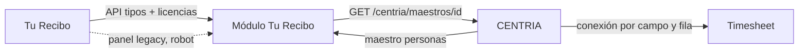

# Módulo Tu Recibo

Módulo externo de CENTRIA. Es el **único** sistema que habla con Tu Recibo:
extrae, guarda el historial en su propia base y publica maestros por el enchufe
de CENTRIA. Los consumidores —Timesheet primero— los leen desde ahí.



## Por qué existe

Hoy la integración está partida: CENTRIA lee el catálogo de tipos de licencia,
KAiROS baja el padrón de licencias y raspa los feriados. Dos sistemas con las
mismas credenciales, dos normalizaciones distintas del mismo dato y ningún dueño.

Este módulo lo unifica. La regla es una sola: **si un dato viene de Tu Recibo,
sale de acá**.

## Qué publica

| Maestro | Clave | Origen |
|---|---|---|
| `tipos-licencia` | `externalId` | `GET /v2/licensesUser/types` |
| `ausencias` | `externalId` | `POST /v2/licensesUser/licenses` |
| `feriados` | `fecha` | Panel legacy vía robot + correcciones manuales |

`dni`, `cuil` y `motivo` están declarados **restringidos**: conectarlos exige
justificación escrita aprobada en CENTRIA. Son los campos que convierten la
tabla de ausencias en un legajo médico.

## Rutas

| Ruta | Quién entra | Con qué |
|---|---|---|
| `GET /centria/manifiesto` | CENTRIA | `x-internal-token` |
| `GET /centria/salud` | CENTRIA | `x-internal-token` |
| `GET /centria/maestros/<id>` | CENTRIA | `x-internal-token` + `x-tenant-id` |
| `POST /api/sync/programado` | GitHub Actions | `x-sync-token` |
| `POST /api/sync/manual` | Persona ADMIN vía proxy | `x-internal-token` + headers de identidad |
| `POST /api/ingesta/feriados` | Robot | `x-feriados-token` |
| `GET\|PUT\|DELETE /api/feriados/overrides` | Persona ADMIN vía proxy | ídem sync manual |

Detalle del contrato en [`docs/CONTRATO.md`](docs/CONTRATO.md).

## Desarrollo

```bash
npm install
npx prisma generate
npm run typecheck && npm test
npm run dev
```

Las funciones de reconciliación (`planificarAusencias`, `planificarFeriados`,
`aplicarOverrides`, `normalizarLicencia`) son puras y se prueban sin base ni red.
Ahí está la lógica que importa; los tests cubren los casos que históricamente
salieron mal (fechas `DD/MM/YYYY`, estados por texto, overrides destructivos).

Para levantar la base la primera vez, con `DATABASE_URL` apuntando a un Postgres
propio:

```bash
npx prisma migrate deploy
```

El robot de feriados es dry-run por defecto:

```bash
node scripts/feriados-robot.mjs --tenant <tenant> --anios 2025,2026
```

## Estado

Implementado y verificado localmente: typecheck, lint, 57 tests y build.

**No desplegado.** No hay recursos Azure creados, el módulo no está registrado
en CENTRIA y no se ejecutó ninguna llamada real a Tu Recibo. `infra/main.bicep`
describe la infraestructura pero no se aplicó.

Los gates pendientes están en [`docs/RUNBOOK.md`](docs/RUNBOOK.md). El más
importante: **CENTRIA todavía no implementa el relay** de módulos que publican
(`GET /centria/maestros/<id>`), así que nada de esto es consumible hasta que esa
etapa esté lista.

## Documentación

- [`docs/CONTRATO.md`](docs/CONTRATO.md) — el enchufe, headers y secretos
- [`docs/DICCIONARIO.md`](docs/DICCIONARIO.md) — qué significa cada campo
- [`docs/RUNBOOK.md`](docs/RUNBOOK.md) — operación, gates y qué hacer cuando falla
- [`docs/MIGRACION.md`](docs/MIGRACION.md) — corte desde CENTRIA y KAiROS
